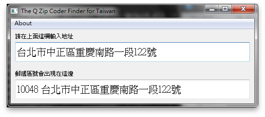

==========
QZipCoder
==========

Offline user interface for zipcodetw.

-----
How?
-----

+++++++++++
Get binary
+++++++++++

1. Download from Releases_.
2. Extract.
3. Run ``qzipcoder.exe`` in the extracted directory.

.. _Releases: https://github.com/uranusjr/qzipcoder/releases

++++++++++++
From Source
++++++++++++

1. Clone.
2. ``pip install -r requirements.txt``.
3. ``python qzipcoder/main.py`` (you might want to use ``pythonw`` instead if you are on OS X).

-----
Why?
-----

Because this is needed.

---------
Can I...
---------

Yes. Do WTF you want.
